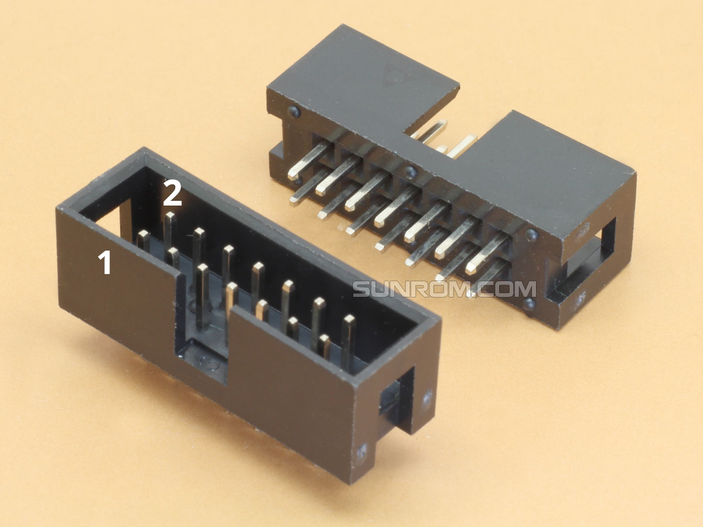
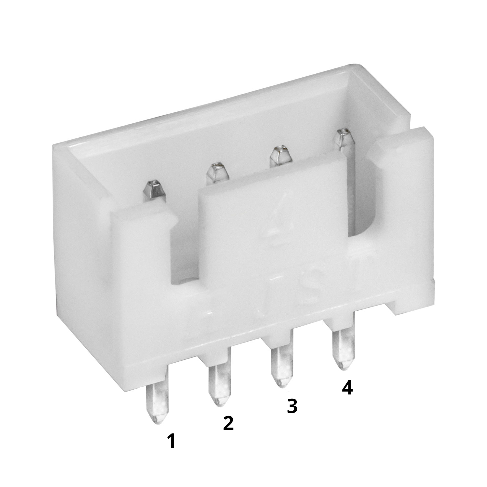

# Pinagem da placa de FPGA HwIT

## Conectores IDC 14 pinos

### CN2

| Pin # | FPGA Pin |
|-------|----------|
|     1 | GND      |
|     2 | 5V       |
|     3 | 3V3      |
|     4 | P17      |
|     5 | T17      |
|     6 | P18      |
|     7 | GND      |
|     8 | N18      |
|     9 | N17      |
|    10 | L20      |
|    11 | M18      |
|    12 | L18      |
|    13 | GND      |
|    14 | G20      |

### CN3

| Pin # | FPGA Pin |
|-------|----------|
|     1 | GND      |
|     2 | 5V       |
|     3 | 3V3      |
|     4 | E19      |
|     5 | B2       |
|     6 | B3       |
|     7 | GND      |
|     8 | K4       |
|     9 | K5       |
|    10 | A2       |
|    11 | K3       |
|    12 | J5       |
|    13 | GND      |
|    14 | J4       |

### CN4

| Pin # | FPGA Pin |
|-------|----------|
|     1 | GND      |
|     2 | 5V       |
|     3 | 3V3      |
|     4 | A19      |
|     5 | D2       |
|     6 | E2       |
|     7 | GND      |
|     8 | B20      |
|     9 | B1       |
|    10 | C2       |
|    11 | B18      |
|    12 | A18      |
|    13 | GND      |
|    14 | B19      |

### CN5

| Pin # | FPGA Pin |
|-------|----------|
|     1 | GND      |
|     2 | 5V       |
|     3 | 3V3      |
|     4 | M4       |
|     5 | R3       |
|     6 | N4       |
|     7 | GND      |
|     8 | M3       |
|     9 | T3       |
|    10 | N3       |
|    11 | T2       |
|    12 | M1       |
|    13 | GND      |
|    14 | N2       |

## Conectores JST 4 pinos

### J1

| Pin # | FPGA Pin |
|-------|----------|
|     1 | F3       |
|     2 | G3       |
|     3 | 3V3      |
|     4 | GND      |

### J2

| Pin # | FPGA Pin |
|-------|----------|
|     1 | U17      |
|     2 | U18      |
|     3 | 3V3      |
|     4 | GND      |

### J3

| Pin # | FPGA Pin |
|-------|----------|
|     1 | H5       |
|     2 | H3       |
|     3 | 3V3      |
|     4 | GND      |

### J4

| Pin # | FPGA Pin |
|-------|----------|
|     1 | J20      |
|     2 | K20      |
|     3 | 3V3      |
|     4 | GND      |

### J5

| Pin # | FPGA Pin |
|-------|----------|
|     1 | C1       |
|     2 | D1       |
|     3 | 3V3      |
|     4 | GND      |

### J6

| Pin # | FPGA Pin |
|-------|----------|
|     1 | B4       |
|     2 | C4       |
|     3 | 3V3      |
|     4 | GND      |

### J7

| Pin # | FPGA Pin |
|-------|----------|
|     1 | T1       |
|     2 | R1       |
|     3 | 3V3      |
|     4 | GND      |

### J8

| Pin # | FPGA Pin |
|-------|----------|
|     1 | W1       |
|     2 | Y2       |
|     3 | 3V3      |
|     4 | GND      |
